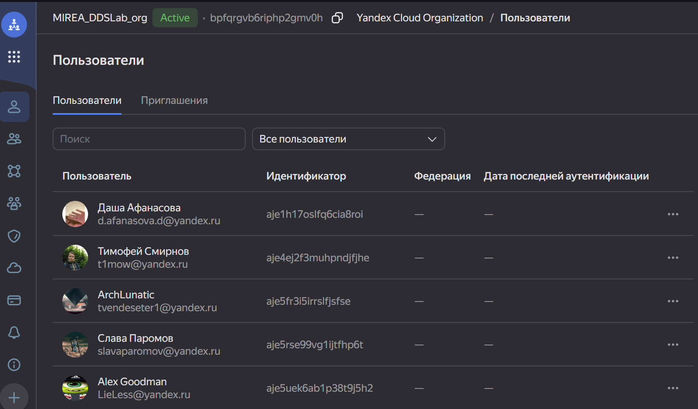
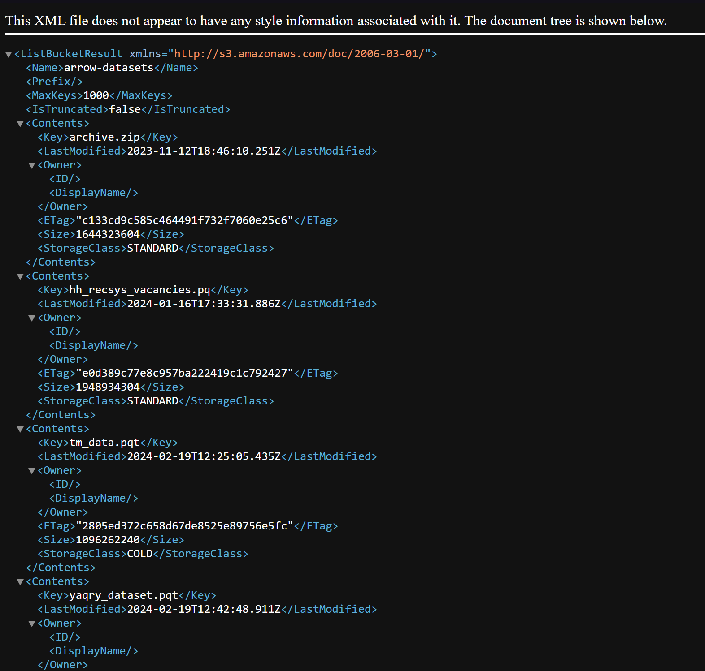
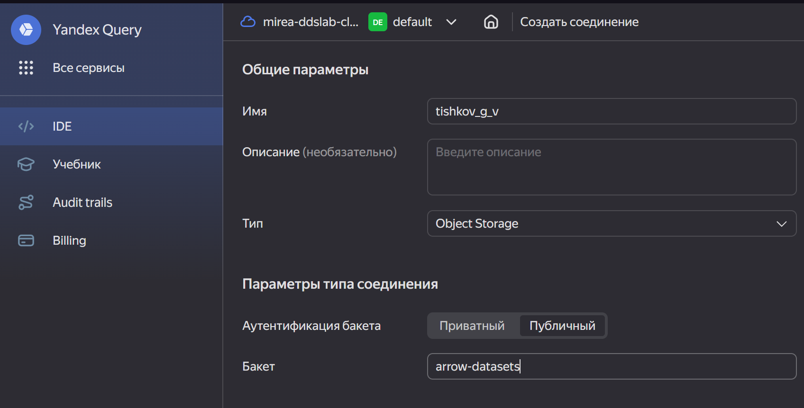
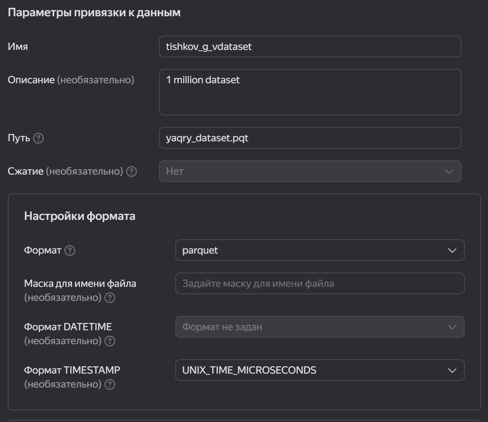
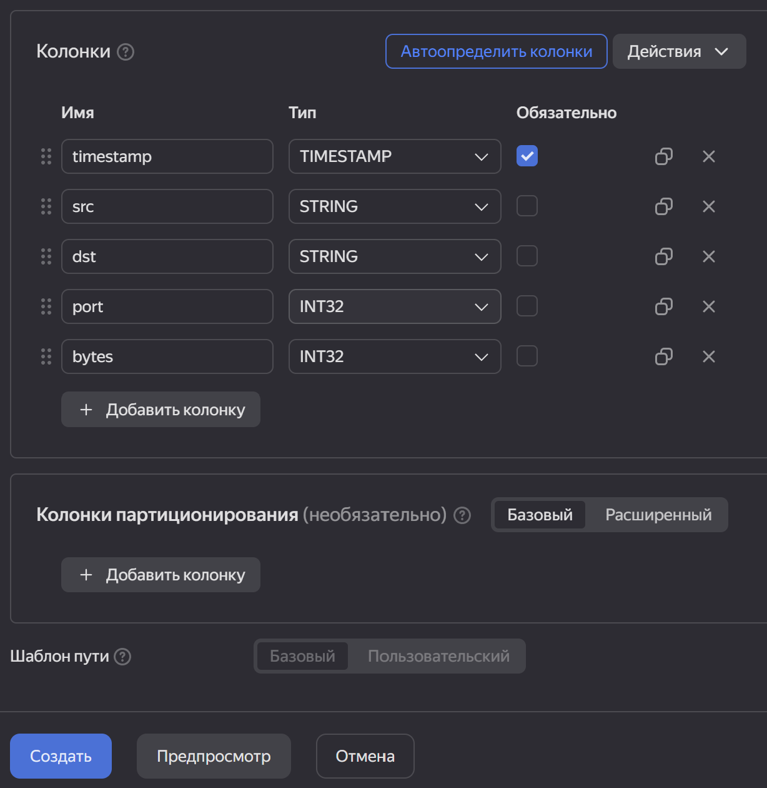
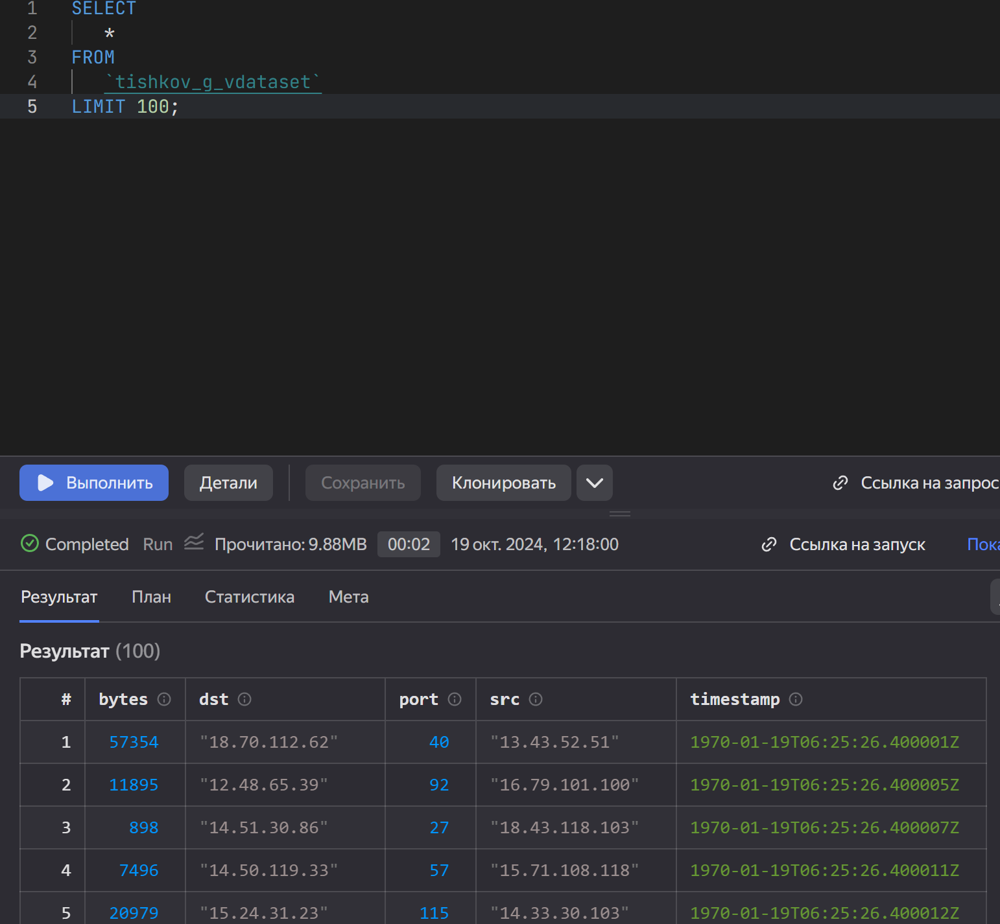
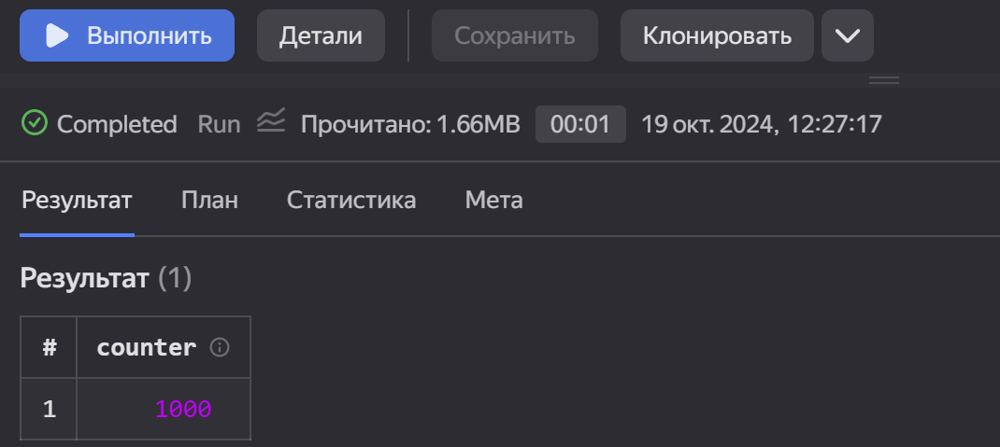
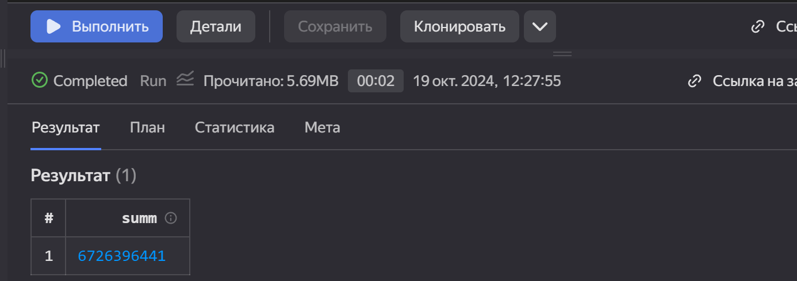
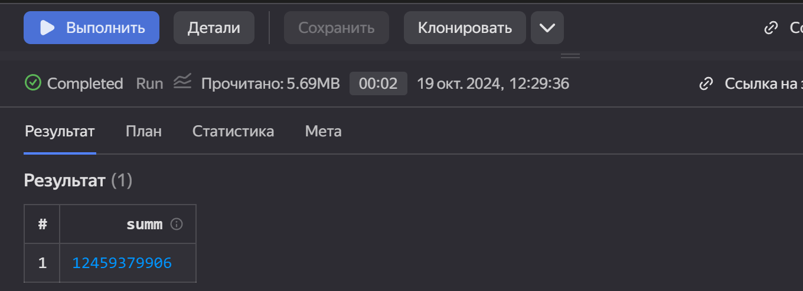

# Использование технологии Yandex Query для анализа данных сетевой активности

## Цель работы

1. Изучить возможности технологии Yandex Query для анализа структурированных наборов данных
2. Получить навыки построения аналитического пайплайна для анализа данных с помощью сервисов Yandex Cloud
3. Закрепить практические навыки использования SQL для анализа данных сетевой активности в сегментированной корпоративной сети

## Исходные данные

1. Программное обеспечение Windows 11
2. Подсоединенный к Yandex Cloud Organization аккаунт
3. Бакет arrow-datasets

## План

1. Проверить доступность данных в бакете
2. Подключить бакет как источник данных
3. Решить задания

## Шаги

1. Присоединяемся к организации. 



2. Проверяем доступность данных с помощью сконструированного URL.



3. Заходим в облако mirea-ddslab-cloud, создаем собственное соединение по своей фамилии





4. Проверяем работоспособность соединения с помощью простого запроса.



5. Выполняем задания:

a) Известно, что IP адреса внутренней сети начинаются с октетов, принадлежащих интервалу [12-14]. Определите количество хостов внутренней сети, представленных в датасете.
```{r}
SELECT
count(DISTINCT src) counter
FROM
`tishkov_g_vdataset`
where src like '12.%' or src like '13.%' or src like '14.%'
```

b) Определите суммарный объем исходящего трафика
```{r}
SELECT
sum(bytes) summ
FROM
`tishkov_g_vdataset`
where (src like '12.%' or src like '13.%' or src like '14.%')
and (dst not like '12.%' and dst not like '13.%' and dst not like '14.%')
```


c)Определите суммарный объем входящего трафика
```{r}
SELECT
sum(bytes) summ
FROM
`tishkov_g_vdataset`
where (dst like '12.%' or dst like '13.%' or dst like '14.%')
and (src not like '12.%' and src not like '13.%' and src not like '14.%')
```


## Оценка результата

В результате работы было установлено соединение с датасетом и были выполнены задания.

## Вывод

Были улучшены навыки написания sql кода. Был проанализирован датасет исходящего/входящего трафика.

